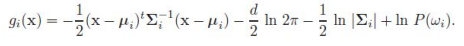
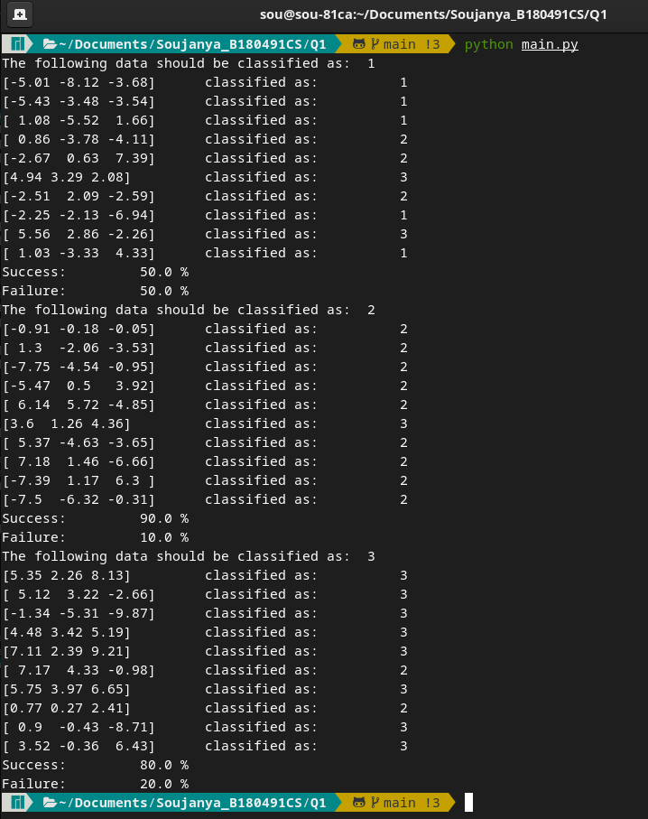
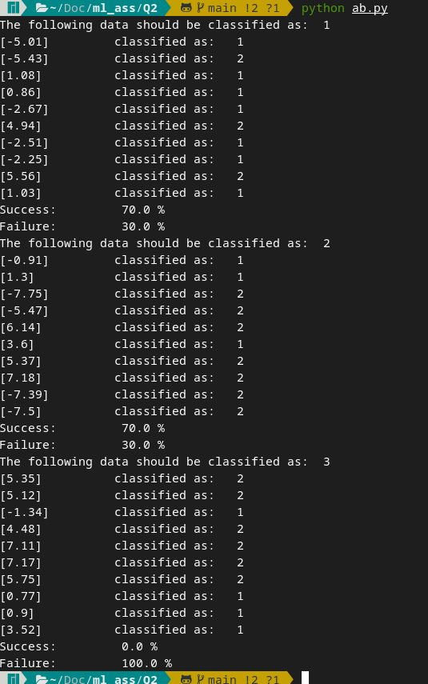
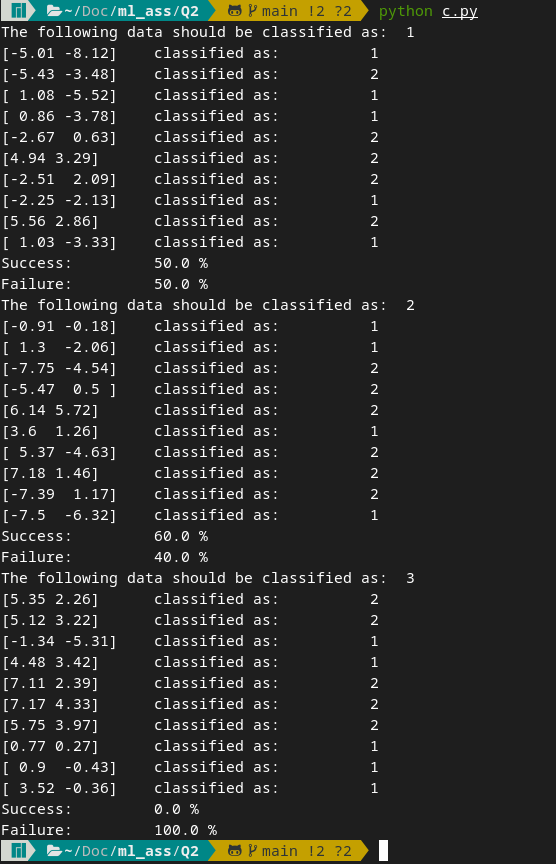
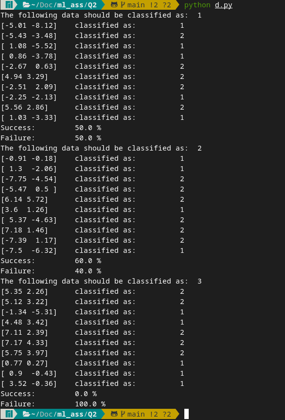
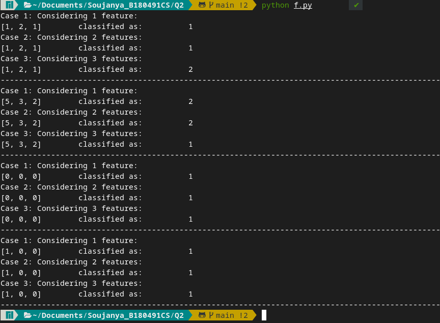

<h1>
    <center>CS4044D Machine Learning</center>
    <center>Assignment 1</center>
</h1>
<h4>
<center> <bold>Submitted by:</bold> Namburi Soujanya, B180491CS </center>
</h4>
<hr /> 

[Repo Link](https://github.com/soujanyanmbri/symmetrical-bassoon)

## Question 1: 

The below formuala is implemented this way:\
 
```
def discriminant(x, mean, covariance, dimension, probability):
    #Check if it is univariate
    if dimension == 1: 
        dis = (-0.5*(x - mean) * (1 / covariance))* (x-mean) - 0.5*log(2*pi) - 0.5*log(covariance) 
    else: 
        temp =np.matmul(-0.5*(x - mean), np.linalg.inv(covariance))
        dis = np.matmul(temp, (x-mean).T) -0.5*dimension*log(2*pi) - 0.5*log(np.linalg.det(covariance))
    if(probability == 0):
        return dis
    else: 
        dis += log(probability)
    return dis
```
Initial check has been done to get rid of numpy errors (inverse of scalar quantities) when the data has the dimension 1 (single feature), other errors can also be avoided with above conditions. 

Other variables should also be initialised along with the data

```
dataclass = [
            [[-5.01, -8.12, -3.68], [-5.43, -3.48, -3.54], [1.08, -5.52, 1.66], [0.86, -3.78, -4.11], [-2.67, 0.63, 7.39], [4.94, 3.29, 2.08], [-2.51, 2.09, -2.59], [-2.25, -2.13, -6.94], [5.56, 2.86, -2.26], [1.03, -3.33, 4.33]],
            [[-0.91, -0.18, -0.05], [1.30, -2.06, -3.53], [-7.75, -4.54, -0.95], [-5.47, 0.50, 3.92], [6.14, 5.72, -4.85], [3.60, 1.26, 4.36], [5.37, -4.63, -3.65], [7.18, 1.46, -6.66], [-7.39, 1.17, 6.30], [-7.50, -6.32, -0.31]],
            [[5.35, 2.26, 8.13], [5.12, 3.22, -2.66], [-1.34, -5.31, -9.87], [4.48, 3.42, 5.19], [7.11, 2.39, 9.21],[7.17, 4.33, -0.98], [5.75, 3.97, 6.65], [0.77, 0.27, 2.41], [0.90, -0.43, -8.71], [3.52, -0.36, 6.43]] 
        ]
    n = len(dataclasses)            # number of classes 
    d = len(dataclasses[0][0])      # number of features

    #Assuming each class is equally probable
    probability = [1/n] * n

    #Find mean and covariance    
    means = []                      # d-component mean vector
    covariance = []                 # d by d covariance matrix for each set
    
    #Finding means in each column
    for sing in dataclasses:
        means.append(sing.mean(axis=0))
        covariance.append(np.cov(sing.T))   

```

( Numpy functions can be used to find mean and covariance )

We can find the g vector using the code below and classify x to the class where g is maximum. Make sure to change the lists to numpy arrays.


```
for dataclass in dataclasses:
        k+=1
        print("The following data should be classified as: ", k)
        missed = 0
        count = 0
        for data in dataclass:
            gi = [0] * n           # each gi 
            for i in range(n):
                gi[i] = discriminant(data, means[i], covariance[i], d, probability[i])
                
            #find maximum g[i]
            maximum_indices = gi.index(max(gi)) + 1
            count+=1
            if(maximum_indices != k):
                missed += 1
            print(data, "\t classified as: \t", maximum_indices )
        print("Success: \t", ((count - missed) / count)*100 , "%")
        print("Failure: \t", ((missed) / count)*100 , "%")
```

This should be the following output: 

 

<hr /> 

## Question 2: 
### Part a and b: 

Change the probabilty from [1/n, 1/n, 1/n] to [0.5, 0.5, 0]
Change the inputs accordingly. (Remove other features except x1)

**Failure percentage is the percentage of points misclassified**
This is the expected output: 
 

### Part C:
Change the inputs accordingly. (Remove other features except x1 and x2)

**Failure percentage is the percentage of points misclassified**
This is the expected output: 
 
### Part D:

Change the inputs accordingly. Use all features.
This is the expected output: 
 

### Part E:

Comparing all the outputs, it is evident that using x1 or using all features is better than the other case. Reason could be higher covariance

### Part F:
Similar to the questions above, we could consider 3 cases: 
1. Only x1 is considered
2. Both x1 and x2 are considered
3. All the features are considered

We use the covariance and mean matrices of the data given above 
```
ix = [[1, 2, 1], [5, 3, 2], [0, 0, 0], [1, 0, 0]]
```


```
for ip in ix:
    print("Case 1: Considering 1 feature: ") 
    d = 1
    for i in range(n):
        g[i] = discriminant(ip[0], means[i][0], covariance[i][0][0], d, probability[i])
    maximum_indices = g.index(max(g)) + 1
    print(ip, "\t classified as: \t", maximum_indices )
    print("Case 2: Considering 2 features: ") 
    d = 2
    for i in range(n):
        g[i] = discriminant(ip[0:2], means[i][0:2], covariance[i][0:2, 0:2], d, probability[i])
    maximum_indices = g.index(max(g)) + 1
    print(ip, "\t classified as: \t", maximum_indices )
    print("Case 3: Considering 3 features: ") 
    d = 3
    for i in range(n):
        g[i] = discriminant(ip, means[i], covariance[i], d, probability[i])
    maximum_indices = g.index(max(g)) + 1
    print(ip, "\t classified as: \t", maximum_indices )
```
This is the output: 
 